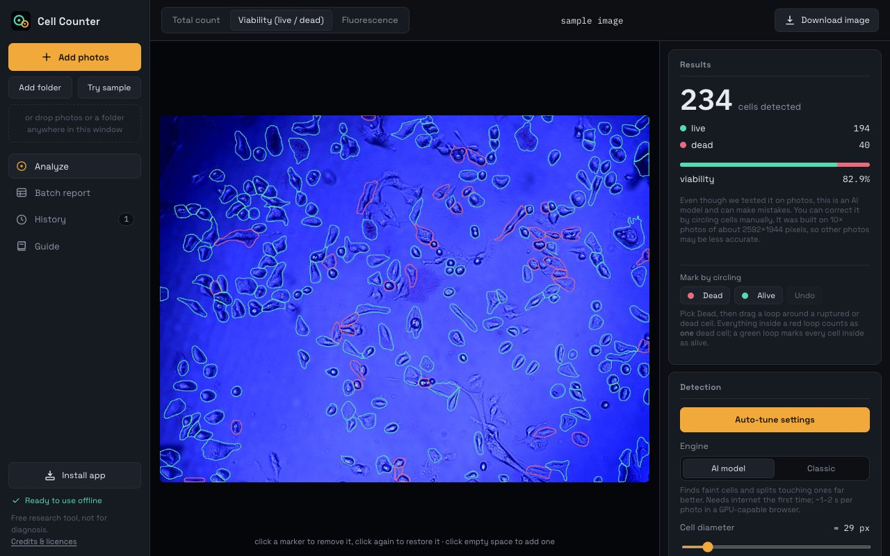
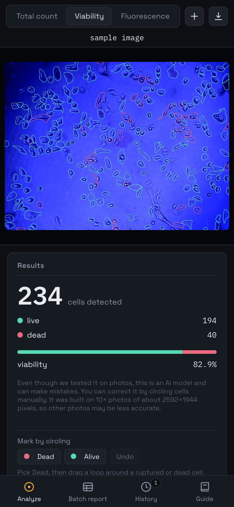

<p align="center">
  
</p>

<h1 align="center">Cell Counter</h1>

<p align="center">
  Count cells in microscope photos and estimate live vs dead cells.<br>
  Free, runs on your own computer, and your photos are never uploaded.
</p>

<p align="center">
  <a href="https://github.com/MertOnen-Research/cell-counter/releases/latest/download/Cell-Counter-mac.dmg"><b>Download for Mac</b></a>
  &nbsp;·&nbsp;
  <a href="https://github.com/MertOnen-Research/cell-counter/releases/latest/download/Cell-Counter-windows-setup.exe"><b>Download for Windows</b></a>
  &nbsp;·&nbsp;
  <a href="https://github.com/MertOnen-Research/cell-counter/releases/latest/download/Cell-Counter-linux.AppImage"><b>Download for Linux</b></a>
  &nbsp;·&nbsp;
  <a href="https://cell-counter.netlify.app"><b>Use it in the browser</b></a>
</p>

<p align="center">
  
</p>

## What it does

- **Counts cells** in brightfield, phase-contrast and fluorescence photos. An AI model outlines every cell, including faint ones and cells that touch.
- **Estimates viability.** Each cell is marked live or dead, from how it looks in unstained photos or from a dye such as trypan blue.
- **Lets you correct it.** Click a cell to remove or restore it, or circle cells to mark them dead or alive. The counts update as you go.
- **Handles whole folders.** Drop a folder and get one report with count, live, dead and viability for every photo, as a spreadsheet (CSV) and as annotated pictures (ZIP).
- **Keeps your photos private.** Everything is computed on your device. Nothing is uploaded and there is no account.

## Get it

| | |
| --- | --- |
| **Desktop app** | [Mac](https://github.com/MertOnen-Research/cell-counter/releases/latest/download/Cell-Counter-mac.dmg) · [Windows](https://github.com/MertOnen-Research/cell-counter/releases/latest/download/Cell-Counter-windows-setup.exe) · [Linux](https://github.com/MertOnen-Research/cell-counter/releases/latest/download/Cell-Counter-linux.AppImage). Works with no internet connection and keeps your History between sessions. Needs macOS 13 or newer, Windows 10 or 11, or a 64-bit Linux. |
| **In the browser** | Open [cell-counter.netlify.app](https://cell-counter.netlify.app). Nothing to install. It can also be installed from the browser as an app (the "Get the app" button). |
| **On a phone or tablet** | Open the web app and choose "Add to Home Screen". |

All versions are the same app. Older releases are on the [releases page](https://github.com/MertOnen-Research/cell-counter/releases).

### Opening the app for the first time

The desktop app is free and is not signed with a paid Apple or Microsoft certificate, so your computer shows a warning the first time you open it. This is expected.

- **Mac:** open the `.dmg` and drag Cell Counter into Applications. Open it once; macOS refuses and says it could not verify the app. Then open **System Settings → Privacy & Security**, scroll down, and click **Open Anyway**. You only do this once.
- **Windows:** run the installer. If "Windows protected your PC" appears, click **More info** and then **Run anyway**.
- **Linux:** make the file executable (`chmod +x Cell-Counter-linux.AppImage`), then run it.

If you would rather avoid the warning, use the web app and install it from the browser instead.

## How to use it

1. Add one photo to inspect it, or several photos (or a whole folder) for a batch report.
2. Pick a mode: **Total count**, **Viability (live / dead)** or **Fluorescence**. Click **Auto-tune settings** if the result looks off.
3. Fix mistakes on the photo. In Viability mode, use **Mark by circling** to draw a loop around dead or alive cells.
4. Download the annotated image, the CSV report, or the ZIP of every annotated photo.

The **Guide** inside the app explains each setting.

<p align="center">
  
</p>

## What to keep in mind

- **It is a research tool, not a medical device.** Do not use it for diagnosis or treatment decisions.
- **Counts are estimates.** Spot-check them against a manual count before you rely on them or report them.
- **The dead-cell detector for unstained photos is a beta.** It was built from cells labelled by hand in photos of one cell line (MDA-MB-231, doxorubicin series, 10× objective) and can be wrong, especially on blurry photos. Correct it by circling cells.
- The AI model was trained on many cell types, but not on your cultures. Very dense, overlapping clumps can still be under-split.

## How it works

- The AI engine is the [Cellpose](https://github.com/MouseLand/cellpose) "cyto3" network, converted to run with [ONNX Runtime Web](https://onnxruntime.ai) on your graphics chip (WebGPU) or processor (WebAssembly). The step that turns the network's output into cell outlines is re-written in JavaScript.
- A second, classic engine (edge detection and watershed) is included as a fast fallback.
- The whole app is one web page ([`app/index.html`](app/index.html)) plus the model file. The desktop app ([`desktop/`](desktop)) is the same page in an [Electron](https://www.electronjs.org) window, with every library bundled so it never uses the network.

## Citing and credits

If you publish results obtained with the AI engine, please cite Cellpose:

- Stringer, C., Wang, T., Michaelos, M. & Pachitariu, M. Cellpose: a generalist algorithm for cellular segmentation. *Nature Methods* 18, 100–106 (2021).
- Pachitariu, M. & Stringer, C. Cellpose 2.0: how to train your own model. *Nature Methods* 19, 1634–1641 (2022).
- Stringer, C. & Pachitariu, M. Cellpose3: one-click image restoration for improved cellular segmentation. *Nature Methods* 22, 592–599 (2025).

Cell Counter is free and non-commercial. The Cellpose authors state that their models are trained on data licensed for non-commercial use, so the model in this app must not be used commercially without their permission. Cell Counter is independent and is not endorsed by HHMI, Janelia or the Cellpose authors.

The licences of everything that is included are in [THIRD_PARTY_NOTICES.md](THIRD_PARTY_NOTICES.md).

## For developers

```
app/        the web app: index.html, the model, the service worker and icons
desktop/    the Electron wrapper and its build settings
.github/    workflows: publish app/ to GitHub Pages, build the desktop downloads on a version tag
```

Run the web app locally by serving `app/` with any static server. Build the desktop app with:

```bash
cd desktop
npm ci
npm run dist
```

A new version is published by pushing a tag such as `v1.0.1`; the workflow builds the Mac, Windows and Linux files and attaches them to a release.
